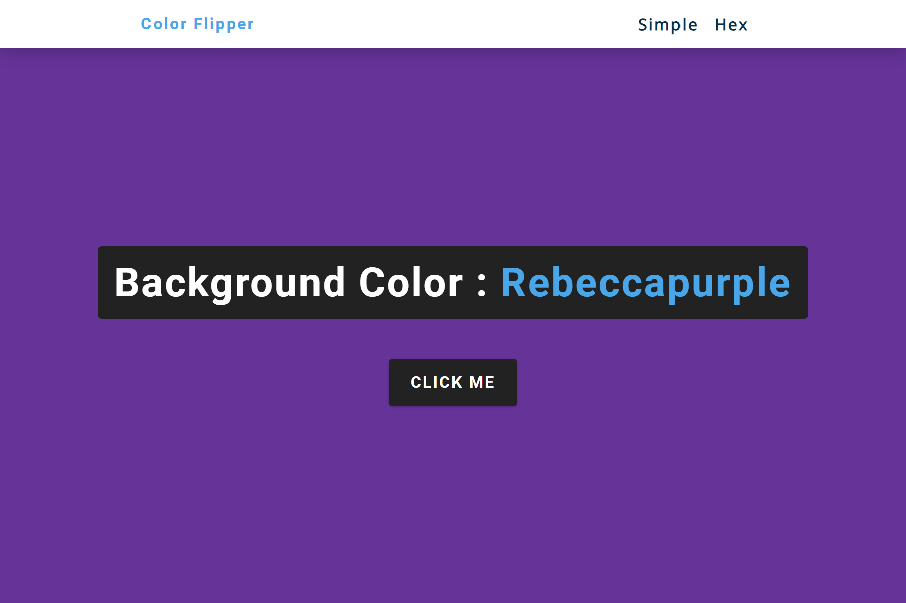
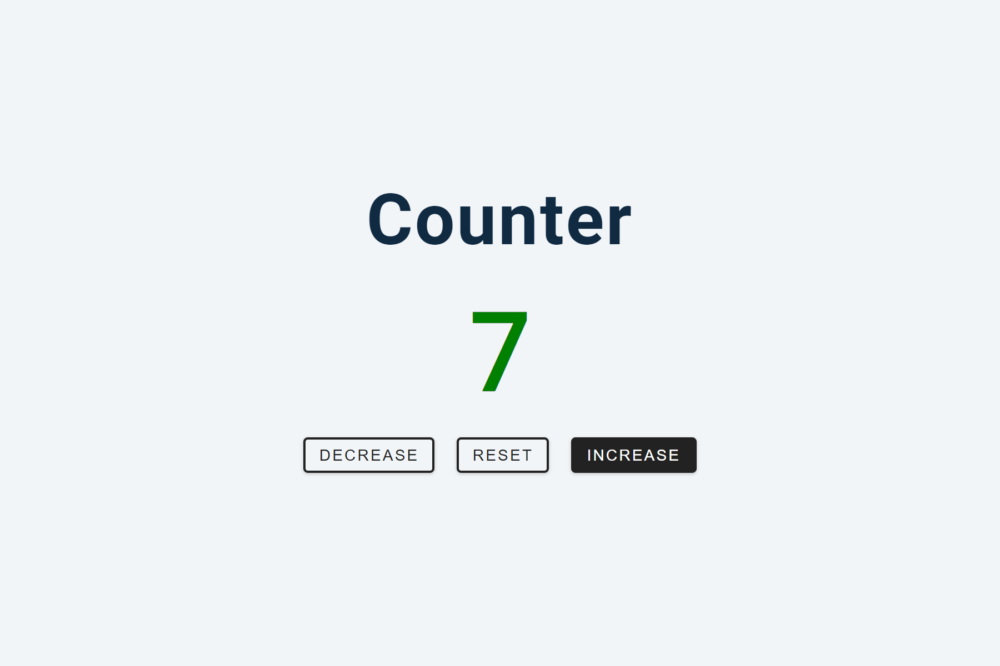

# Vanilla JavaScript Projects

Sharpen your JavaScript skills by building projects using plain JavaScript without frameworks.

| Table of Contents                                                     |
| --------------------------------------------------------------------- |
| [01-Color Flipper](#01-color-flipper)                                 |
| [02-Counter](#02-counter)                                             |
| [03-Reviews](#03-reviews)                                             |

# Projects

## 01-Color-Flipper

- Live Site URL: [https://fundakartal.github.io/vanilla-javascript-projects/01-color-flipper/index.html](https://fundakartal.github.io/vanilla-javascript-projects/01-color-flipper/index.html)
- Repository URL: [https://github.com/fundakartal/vanilla-javascript-projects/tree/main/01-color-flippert](https://github.com/fundakartal/vanilla-javascript-projects/tree/main/01-color-flipper)

## 02-Counter

- Live Site URL: [https://fundakartal.github.io/vanilla-javascript-projects/02-counter/index.html](https://fundakartal.github.io/vanilla-javascript-projects/02-counter/index.html)
- Repository URL: [https://github.com/fundakartal/vanilla-javascript-projects/tree/main/02-counter](https://github.com/fundakartal/vanilla-javascript-projects/tree/main/02-counter)

## 03-Reviews

- Live Site URL: [https://fundakartal.github.io/vanilla-javascript-projects/03-reviews/index.html](https://fundakartal.github.io/vanilla-javascript-projects/03-reviews/index.html)
- Repository URL: [https://github.com/fundakartal/vanilla-javascript-projects/tree/main/03-reviews](https://github.com/fundakartal/vanilla-javascript-projects/tree/main/03-reviews)

## Credits

[Build 15 JavaScript Projects - Vanilla JavaScript Course by John Smilga](https://www.youtube.com/watch?v=3PHXvlpOkf4)